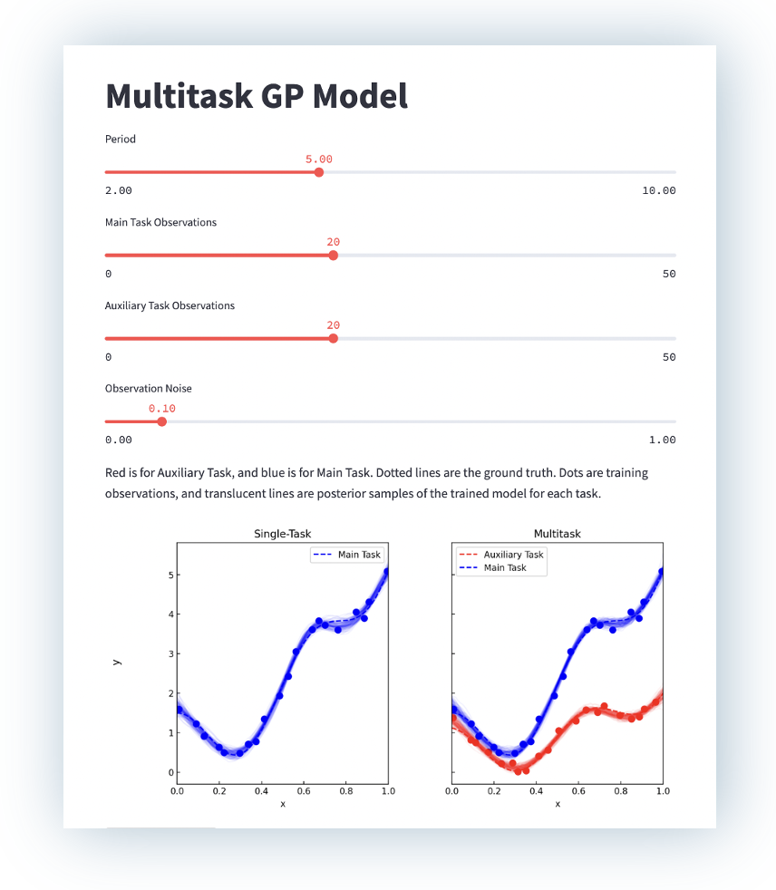

# Multitask Demo App

This is a demo of multitask Gaussian processes, which are a key component of [multitask Bayesian optimization](https://en.wikipedia.org/wiki/Multitask_optimization). Try it [here](https://marcosfelt-multitask-demo-app-s4dpus.streamlitapp.com/).

<p align="center">
<a href='https://marcosfelt-multitask-demo-app-s4dpus.streamlitapp.com/'>
    
</a>
</p>


## Instructions for running locally.

1. Clone the code and change into the repository

    ```
    git clone https://github.com/marcosfelt/multitask_demo.git
    cd multitask_demo
    ```
2. Create virtual environment and install dependencies

    ```
    python3 -m venv .venv
    source .venv/bin/activate
    pip install streamlit
    pip install -r requirements.txt
    ```
3. Start the app

    ```
    streamlit run app.py
    ```